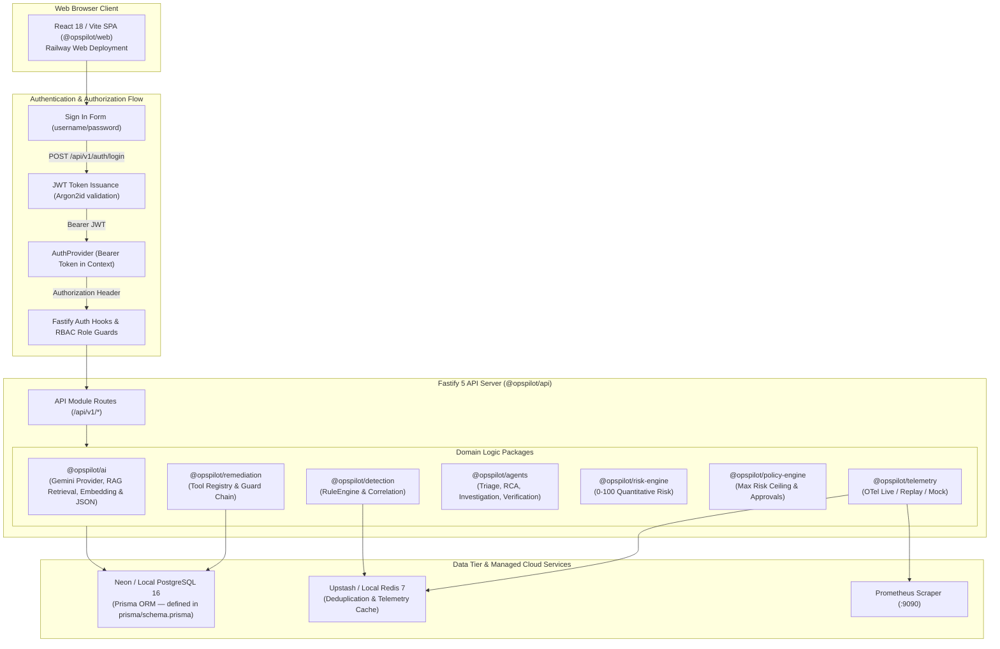

# OpsPilot AI 🚀

> **From Alert to Autonomous Resolution** — An AI-Native IT Operations & SRE Control Tower for Microservice Incident Management, Multi-Agent Root Cause Analysis, Governed Remediation, and Metric Recovery Verification.

[](https://www.typescriptlang.org/)
[](https://reactjs.org/)
[](https://www.fastify.io/)
[](https://www.prisma.io/)
[](https://www.postgresql.org/)
[](https://redis.io/)
[](https://opentelemetry.io/)
[](./DEPLOYMENT.md)

---

## 📑 Table of Contents

- [Overview](#overview)
- [Monorepo Architecture](#monorepo-architecture)
- [Public Cloud Deployment (Free Tier)](#public-cloud-deployment-free-tier)
- [Security](#security)
- [Local Quick Start](#local-quick-start)
- [Telemetry Providers (Live OTel, Mock, Replay)](#telemetry-providers-live-otel-mock-replay)
- [Incident Detection & Correlation Engine](#incident-detection--correlation-engine)
- [Autonomous SRE AI Agent Suite](#autonomous-sre-ai-agent-suite)
- [Governed Remediation & 0-100 Risk Engine](#governed-remediation--0-100-risk-engine)
- [Documentation & Deployment Guide](#documentation--deployment-guide)

---

## 🌟 Overview

OpsPilot AI combines Observability, AIOps, Autonomous SRE Agents, Risk Management, Policy-based Safety Guardrails, Human Approval Workflows, and Blameless Postmortems into a unified IT Operations Control Tower.

### Key Capabilities

1. **Multi-Source Telemetry Pipeline**:
   - Live OpenTelemetry Prometheus Scraper (`:9090`), Telemetry Replay Engine, and Standby Mock Telemetry Provider.
2. **Detection & 5-Criteria Alert Correlation**:
   - Threshold Rule Engine (`cpuPercent > 85%`, `errorRate > 5%`, `latencyP99 > 1500ms`), 15-min Redis deduplication, and 5-criteria point-scoring correlation algorithm.
3. **Autonomous SRE AI Agent Suite**:
   - `TriageAgent`: P1–P5 severity classification and business impact estimation.
   - `EvidenceCollector`: Multi-source telemetry metrics, log traces, deployment commits, and past resolution logs.
   - `InvestigationAgent`: Findings synthesis, component ranking, and chronological timeline reconstruction.
   - `KnowledgeAgent`: Active runbook matching based on service topology.
   - `RCAAgent`: Probable root cause determination & prioritized remediation action recommendations.
   - `VerificationAgent`: Post-remediation metric recovery verification.
   - `PostmortemAgent`: Blameless postmortem generation upon incident resolution.
4. **Governed Autonomous Remediation**:
   - `RiskEngine`: Quantitative 0–100 risk score based on 6 operational factors (Business Criticality, Blast Radius, Irreversibility, Environment, AI Uncertainty, Historical Failure Rate).
   - `PolicyEngine`: Max autonomous risk ceiling rules and human-in-the-loop approval triggers.
   - `RemediationExecutor`: 7-layer guard chain executing 5 remediation tools (`ROLLBACK_DEPLOYMENT`, `RESTART_SERVICE`, `SCALE_SERVICE`, `CLEAR_CACHE`, `RETRY_BATCH`).
5. **Web Control Tower UI**:
   - Real-time Command Center (`http://localhost:3000`), Chaos Lab failure simulator, Incident Detail with RCA alert cards, Evidence Pool, Governed Approval controls, Interactive AI Copilot Chat Drawer, and Settings page.

---

## 🏗️ Monorepo Architecture



> **Note on Feature Flags:** Advanced modules (`ENABLE_GOVERNANCE_CONTROL_CENTER`, `ENABLE_DRIFT_MONITORING`, `ENABLE_AI_INCIDENT_MGMT`, `ENABLE_REPORTING`, `ENABLE_REMEDIATION_V2`) are present in compiled backend packages but remain dormant (evaluating `false`) in default deployments until explicitly enabled via environment variables.

The repository is structured as a TypeScript monorepo using **pnpm workspaces** and **Turborepo**:

```text
/Users/pankaja/AI Projects/OpsAI
├── apps/
│   ├── api/            # Fastify 5 REST & SSE Backend Server (Port 3001)
│   └── web/            # React 18 / Vite / Tailwind Control Tower UI (Port 3000)
├── packages/
│   ├── types/          # Domain schemas & Zod validators
│   ├── config/         # Environment loader & Zod config schema
│   ├── telemetry/      # Telemetry Provider Abstraction (OTel, Replay, Mock)
│   ├── detection/      # RuleEngine, CorrelationEngine, LifecycleManager, ImpactAnalyzer
│   ├── ai/             # Gemini API Provider, RAG Retrieval & SRE Mock Provider
│   ├── agents/         # Autonomous SRE AI Agents Suite
│   ├── policy-engine/  # Deterministic Policy Engine
│   ├── risk-engine/    # 0-100 Quantitative Risk Engine
│   └── remediation/    # Executable Tool Registry & Safety Guard Chain
├── prisma/
│   ├── schema.prisma   # PostgreSQL Prisma Schema (35 models, 14 enums)
│   └── migrations/     # Version-controlled SQL migrations
├── scripts/
│   └── seed.ts         # Database Seeding script
```

---

## ☁️ Public Cloud Deployment (100% Free Tier)

OpsPilot AI is configured for easy zero-cost deployment to public cloud services for demonstrations and learning:

- **Frontend UI**: [Railway Free Tier](https://railway.app) (`https://opspilotweb-production.up.railway.app`)
- **Backend API**: [Railway Free Tier](https://railway.app) (`https://opspilotapi-production.up.railway.app`)
- **Database**: [Neon Managed Serverless PostgreSQL](https://neon.tech)
- **Redis Cache**: [Upstash Managed Serverless Redis](https://upstash.com)

👉 **For complete step-by-step instructions, view the [`DEPLOYMENT.md`](./DEPLOYMENT.md) guide.**

---

## 🔒 Security

This project follows a threat-model-first approach for all security-relevant work. See:
- [`THREAT_MODEL_SECURITY_RETROFIT.md`](./THREAT_MODEL_SECURITY_RETROFIT.md) — full risk register (R-01–R-18) and mitigations
- [`AUTHZ_AUDIT.md`](./AUTHZ_AUDIT.md) — complete route-by-route authorization audit

Report any security concerns by opening an issue on [GitHub Issues](https://github.com/adityasaxena-ai/OpsPilot-AI/issues) or contacting project maintainers.

---

## 💻 Local Quick Start

### Prerequisites
- **Node.js**: v22.13.0 or higher
- **pnpm**: v11.20.0 or higher (`npm install -g pnpm`)
- **Docker**: Docker Desktop (`docker compose`)

---

### Option A: One-Command Full Stack (Docker Compose)

Run the entire OpsPilot AI stack (PostgreSQL, Redis, OpenTelemetry Collector, Prometheus, API backend, and Web UI) inside Docker with a single command — zero manual setup beyond copying `.env`.

```bash
# 1. Clone repository and set up environment file
git clone https://github.com/adityasaxena-ai/OpsPilot-AI.git
cd OpsPilot-AI
cp .env.example .env

# 2. Spin up full application stack with automatic migrations and seed data
docker compose up --build -d
```

Database migrations and initial domain seeding (`prisma migrate deploy` & `scripts/seed.ts`) execute automatically inside the container on startup.

- 🌐 **Web Control Tower UI**: [http://localhost:3000](http://localhost:3000)
- ⚙️ **Fastify API Server**: [http://localhost:3001](http://localhost:3001)
- 📊 **Prometheus Server**: [http://localhost:9090](http://localhost:9090)

---

### Option B: Direct Local Dev (Host Node.js + Local DB)

Ideal for rapid iterative development on host Node.js with hot reloading.

```bash
# 1. Clone repository and install dependencies
git clone https://github.com/adityasaxena-ai/OpsPilot-AI.git
cd OpsPilot-AI
pnpm install

# 2. Start local PostgreSQL and Redis containers only
docker compose up -d postgres redis

# 3. Copy environment file and setup database schema & seed data
cp .env.example .env
pnpm db:migrate
pnpm db:seed

# 4. Start API backend and Web frontend dev servers
pnpm dev
```

- 🌐 **Web Control Tower UI**: [http://localhost:3000](http://localhost:3000)
- ⚙️ **Fastify API Server**: [http://localhost:3001](http://localhost:3001)

---

## 📄 Documentation Links
* 📘 [Deployment Guide (`DEPLOYMENT.md`)](./DEPLOYMENT.md) — Step-by-step public cloud deployment guide.
* 📕 [Phase 1 Validation Report](./phase1_validation_report.md) — OpenTelemetry & Telemetry Replay Mode signoff.
* 📙 [Implementation Plan](./implementation_plan.md) — Architectural design specs.

---

## 📝 License

Distributed under the MIT License. See `LICENSE` for more information.
